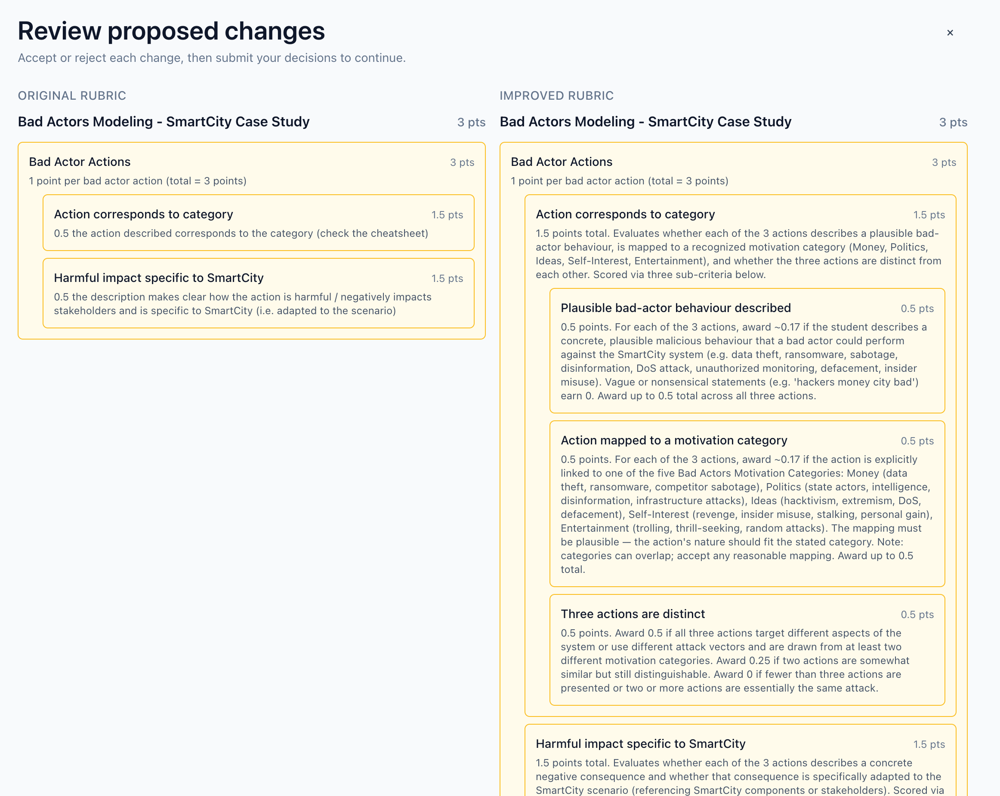

# Grading Rubric Studio

An AI-powered pipeline that assesses and improves the quality of grading rubrics for large-class exams. Given an exam question and (optionally) teaching materials, an existing rubric, and student copies, the system produces an improved rubric with a teacher-facing explanation of every change, scored against three quality criteria: **Ambiguity**, **Applicability**, and **Discrimination Power**.



**Live demo:** [https://epfl-rubric.validance.io](https://epfl-rubric.validance.io) — upload your exam question and rubric, review proposed changes, download the improved rubric. No local installation required.

## Approach

### Core idea

The LLM is never asked to judge rubric quality directly. Instead, the system uses the LLM as a **simulated grader**: it generates a panel of diverse grader personas, synthesizes a calibrated cohort of student responses, and has each persona grade each response using the teacher's rubric. All quality metrics are then computed by Python from the resulting grading traces — standard-deviation-based agreement, difficulty-weighted applicability rates, calibration error, rank correlation, and pairwise consistency.

### Pipeline

```
ingest → parse → assess → propose → score → render → output.json
                   ▲                   │
                   └───── iteration ────┘
```


| Stage       | What it does                                                                                                                                                                |
| ----------- | --------------------------------------------------------------------------------------------------------------------------------------------------------------------------- |
| **Ingest**  | Reads input files (PDF, DOCX, text), computes hashes, tags each input by role                                                                                               |
| **Parse**   | Extracts text (OCR for handwritten copies), decomposes the rubric into structured criteria using a one-time Opus call                                                       |
| **Assess**  | Synthesizes student responses to fill quality tiers, runs a 4-persona grader simulation (40 grading calls + 10 pairwise), computes before-scores, emits actionable findings |
| **Propose** | LLM planner proposes rubric changes grounded in findings and evidence; three-step pipeline: conflict resolution → canonical ordering → apply-and-wrap                       |
| **Score**   | Re-runs the grader simulation on the improved rubric with the **same response set** (apples-to-apples), computes after-scores and deltas                                    |
| **Render**  | Assembles the final JSON deliverable with starting rubric, improved rubric, changes, explanation, and quality scores                                                        |


### Quality criteria

Each criterion is scored 0–1, computed from simulation traces:

- **Ambiguity** — Do graders agree? Measured via Krippendorff's α (ordinal) across a 4-persona grader panel. α ≥ 0.80 = good agreement, 0.67–0.80 = moderate, < 0.67 = poor. Score is the weighted average of per-criterion α values.
- **Applicability** — Can graders apply every criterion? Measured via edge-case polarization rate and orphan detection. Score = `1 - weighted_problem_rate`. External dependencies (e.g. "check the cheatsheet") surface here.
- **Discrimination Power** — Does the rubric separate strong from weak work? When synthetic calibration data is available: 4-component weighted average — calibration error (0.25), rank correlation (0.20), pairwise consistency (0.15), ceiling score (0.40). Hard cap of 0.60 when >50% of non-excellent synthetics score ≥ 0.90. Fallback (no calibration): `0.5 × separation + 0.5 × pairwise_consistency`.

## Installation

### Prerequisites

- Python 3.11+
- An Anthropic API key (OCR, rubric decomposition, planning) **and** an OpenAI API key (grader simulation)

### Install from source

```bash
git clone git@github.com:Wik-dev/grading_rubric.git
cd grading_rubric
pip install .
```

### Install dev dependencies (for tests and linting)

```bash
pip install ".[dev]"
```

### Dependencies

Installed automatically via `pip install .`:


| Package               | Purpose                           |
| --------------------- | --------------------------------- |
| `anthropic`           | LLM backend (Claude API)          |
| `openai`              | Optional alternative LLM backend  |
| `pydantic`            | Data models and schema validation |
| `krippendorff`        | Inter-rater agreement statistics  |
| `pypdf`, `pdfplumber` | PDF text extraction               |
| `python-docx`         | DOCX text extraction              |
| `Pillow`              | Image handling for OCR            |
| `PyYAML`              | Prompt front-matter parsing       |
| `click`               | CLI framework                     |


## Usage

### Running the full pipeline

```bash
export ANTHROPIC_API_KEY="sk-ant-..."
export OPENAI_API_KEY="sk-proj-..."

grading-rubric-cli run-pipeline \
    --exam-question project_materials/exam_question/ExamQuestionAndRubric.pdf \
    --teaching-material project_materials/teaching_material/TeachingResource-BAD_ACTORS_STRATEGY.pdf \
    --starting-rubric project_materials/starting_rubric/ExamQuestionAndRubric.pdf \
    --student-copy project_materials/student_copy/StudentAnswer-Student1.pdf \
    --student-copy project_materials/student_copy/StudentAnswer-Student2.pdf \
    --student-copy project_materials/student_copy/StudentAnswer-Student3.pdf \
    --output result.json
```

Only `--exam-question` is required. All other inputs are optional:


| Flag                       | Description                                               |
| -------------------------- | --------------------------------------------------------- |
| `--exam-question`          | Exam question (PDF, DOCX, or text file). **Required.**    |
| `--teaching-material`      | Teaching material for grounding (repeatable)              |
| `--starting-rubric`        | Existing rubric to improve (PDF, DOCX, or text)           |
| `--starting-rubric-inline` | Existing rubric as inline text or JSON                    |
| `--student-copy`           | Student response for discrimination analysis (repeatable) |
| `--output`                 | Output path (default: stdout)                             |


### Running individual stages

The same `project_materials/` directory doubles as the role-tagged input root for stage-by-stage execution:

```bash
grading-rubric-cli ingest       --input-root project_materials   --output ingest_outputs.json
grading-rubric-cli parse-inputs --input ingest_outputs.json       --output parsed_inputs.json
grading-rubric-cli assess       --input parsed_inputs.json        --output assess_outputs.json
grading-rubric-cli propose      --input assess_outputs.json       --output propose_outputs.json
grading-rubric-cli score        --input propose_outputs.json      --output score_outputs.json
grading-rubric-cli render       --input score_outputs.json        --output explained_rubric.json
```

### Docker (optional)

Build the image locally (on macOS, Docker Desktop must be running):

```bash
make images
# or manually:
docker build -t grading-rubric:latest -f docker/grading-rubric/Dockerfile .
```

Run the pipeline in a container:

```bash
docker run -e ANTHROPIC_API_KEY -e OPENAI_API_KEY \
    -v "$(pwd)":/work \
    grading-rubric:latest \
    grading-rubric-cli run-pipeline \
        --exam-question project_materials/exam_question/ExamQuestionAndRubric.pdf \
        --output result.json
```

### Validance integration (optional)

The pipeline can be orchestrated by a [Validance](https://validance.io) instance, adding audit trails, human approval gates, and retry orchestration.

**Install the Validance SDK:**

```bash
git clone git@github.com:validance-io/sdk-python.git
cd sdk-python && pip install -e . && cd ..
```

**Register workflows:**

```bash
VALIDANCE_BASE_URL=https://api.validance.io python -m validance_integration.register
# or: make register
```

**Monitor, audit, and retry** via the Validance REST API: [https://api.validance.io/docs#/](https://api.validance.io/docs#/)

## Expected output

The output is a single JSON file with the following structure:

```json
{
  "schema_version": "1.0.0",
  "generated_at": "2026-04-13T...",
  "run_id": "e74ac638",
  "starting_rubric": { "title": "...", "criteria": [...], "total_points": 3.0 },
  "improved_rubric": { "title": "...", "criteria": [...], "total_points": 3.0 },
  "findings": [
    {
      "id": "finding-001",
      "criterion": "applicability",
      "severity": "HIGH",
      "description": "Graders could not apply cheatsheet reference...",
      "confidence": 0.72
    }
  ],
  "proposed_changes": [
    {
      "operation": "REPLACE_FIELD",
      "primary_criterion": "applicability",
      "rationale": "Replaced unavailable cheatsheet dependency with explicit guidance",
      "status": "APPLIED",
      "source_findings": ["finding-001"]
    }
  ],
  "explanation": {
    "summary": "Assessed the rubric against three quality criteria...",
    "by_criterion": {
      "ambiguity": { "finding_refs": [...], "change_refs": [...] },
      "applicability": { "finding_refs": [...], "change_refs": [...] },
      "discrimination_power": { "finding_refs": [...], "change_refs": [...] }
    }
  },
  "quality_scores": [
    { "criterion": "ambiguity", "score": 0.788, "confidence": { "score": 0.72, "level": "MEDIUM", "rationale": "..." }, "method": "grader_simulation" },
    { "criterion": "applicability", "score": 0.734, "confidence": { "score": 0.72, "level": "MEDIUM", "rationale": "..." }, "method": "grader_simulation" },
    { "criterion": "discrimination_power", "score": 0.764, "confidence": { "score": 0.72, "level": "MEDIUM", "rationale": "..." }, "method": "grader_simulation" }
  ],
  "previous_quality_scores": [
    { "criterion": "ambiguity", "score": 0.762, "confidence": { "score": 0.72, "level": "MEDIUM", "rationale": "..." }, "method": "grader_simulation" },
    { "criterion": "applicability", "score": 0.344, "confidence": { "score": 0.72, "level": "MEDIUM", "rationale": "..." }, "method": "grader_simulation" },
    { "criterion": "discrimination_power", "score": 0.735, "confidence": { "score": 0.72, "level": "MEDIUM", "rationale": "..." }, "method": "grader_simulation" }
  ],
  "evidence_profile": {
    "starting_rubric_present": true,
    "exam_question_present": true,
    "teaching_material_present": true,
    "teaching_material_count": 1,
    "student_copies_present": true,
    "student_copies_count": 3,
    "synthetic_responses_used": true
  }
}
```

### Example results

On a 3-point Bad Actors Modeling rubric (SmartCity case study) with 3 real student copies and 7 synthetic responses:


| Metric         | Before | After | Delta      |
| -------------- | ------ | ----- | ---------- |
| Ambiguity      | 0.762  | 0.788 | +0.026     |
| Applicability  | 0.344  | 0.734 | **+0.391** |
| Discrimination | 0.735  | 0.764 | +0.028     |


The largest improvement was applicability (+0.39): the original rubric referenced an unavailable cheatsheet, which the system detected through grader simulation (personas couldn't apply the criterion) and resolved by inlining explicit category definitions.

### Web UI (Validance-orchestrated)

A browser-based interface is available at **[https://epfl-rubric.validance.io](https://epfl-rubric.validance.io)**. It runs the same six-stage pipeline orchestrated by a Validance instance (`https://api.validance.io`) with an approval gate — the teacher reviews and accepts/rejects each proposed change before scoring.

1. Open [https://epfl-rubric.validance.io](https://epfl-rubric.validance.io)
2. Upload your exam question, teaching materials, student copies, and (optionally) a starting rubric
3. Click **Start** — the pipeline runs server-side
4. When the approval gate fires, review each proposed change and accept or reject it
5. The final explained rubric appears in the Results screen

This path requires no local installation — files are uploaded to the Validance instance and tasks run in Docker containers on the server.

## Configuration

All settings are via environment variables (defaults are sensible):


| Variable                         | Default                    | Description                                                               |
| -------------------------------- | -------------------------- | ------------------------------------------------------------------------- |
| `ANTHROPIC_API_KEY`              | —                          | Anthropic API key (**required**)                                          |
| `OPENAI_API_KEY`                 | —                          | OpenAI API key (**required** — grader simulation uses GPT-5.4 by default) |
| `GR_OCR_BACKEND`                 | `anthropic`                | OCR / text extraction backend (`anthropic`, `openai`, `stub`)             |
| `GR_OCR_MODEL`                   | `claude-sonnet-4-20250514` | Model for OCR and text extraction (parse stage)                           |
| `GR_REASONING_MODEL`             | `claude-opus-4-6`          | Model for rubric decomposition + proposal generation                      |
| `GR_SIMULATION_BACKEND`          | `openai`                   | Backend for grader simulation (assess + score stages)                     |
| `GR_SIMULATION_MODEL`            | `gpt-5.4`                  | Model for grader simulation                                               |
| `GR_SIMULATION_PANEL_SIZE`       | `4`                        | Number of grader personas per response                                    |
| `GR_SIMULATION_TARGET_RESPONSES` | `10`                       | Total responses (real + synthetic)                                        |
| `GR_SIMULATION_PAIRWISE_PAIRS`   | `10`                       | Max pairwise comparisons per simulation                                   |
| `GR_SIMULATION_CONCURRENCY`      | `4`                        | Max concurrent grading LLM calls                                          |


## Tests

```bash
# 161 tests run
pip install ".[dev]"
pytest
```

## Documentation

- [Architecture diagram](docs/architecture.pdf) — System architecture overview
- [Requirements](docs/requirements.md) — User needs, user requirements, system requirements
- [Design](docs/design.md) — Architecture, data models, design requirements
- [Verification Plan](docs/verification-plan.md) — Test strategy and procedures

